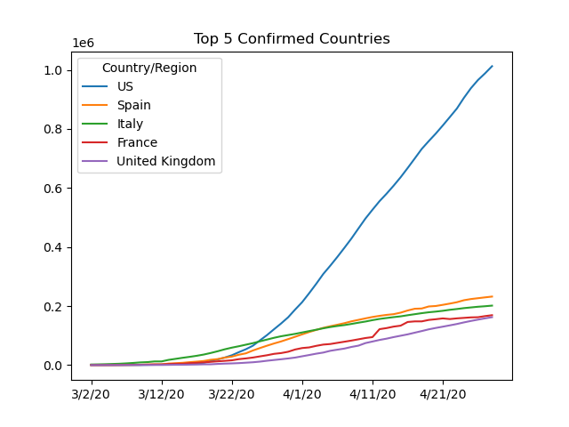

# COVID-19-Graphs

## Pandas Analysis of COVID-19 spread

### Overview
Uses Python's pandas library and data from [this](https://github.com/CSSEGISandData/COVID-19) repository to graph interesting patterns in COVID-19 spread.

### Sample Graphs

### Requirments
* Packages: pandas
* CSV files from repo in overview

### Future Work
* line graph of confirmed sorted by biggest/smallest growth last 24 hours (slope)
* line graph of confirmed by proportion of country's population
* scatter plot to explore growth rate and population density
* bar chart of biggest/smallest growth last 24 hours (slope)
* bar chart of total deaths
* bar chart of death rates
* move study to web app

### Sources
* https://github.com/CSSEGISandData/COVID-19
* https://worldpopulationreview.com/countries/countries-by-density/
